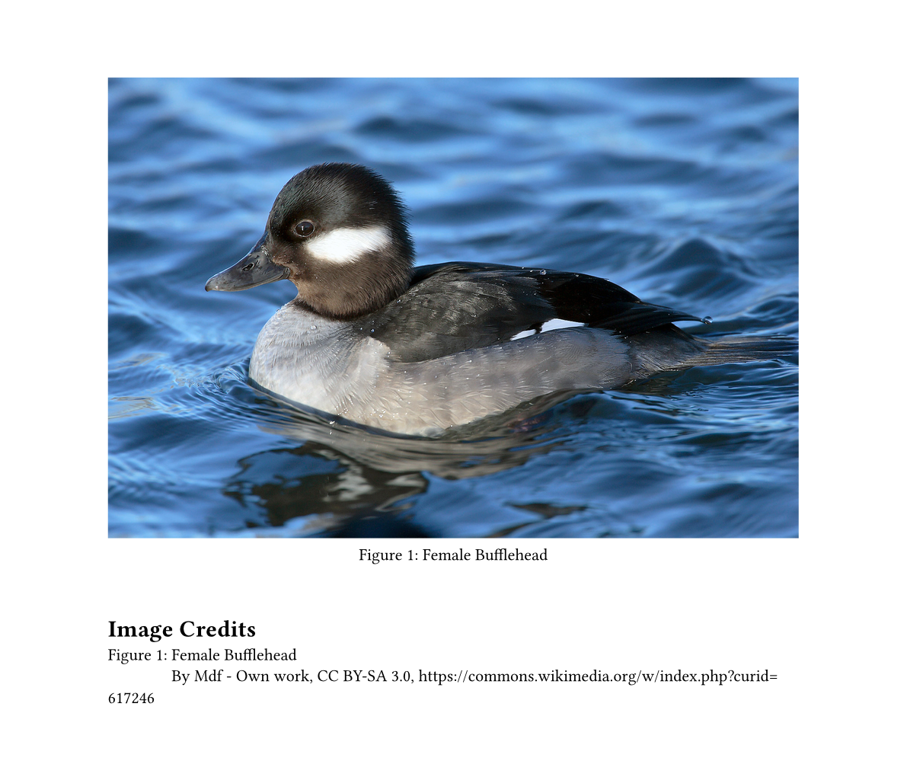
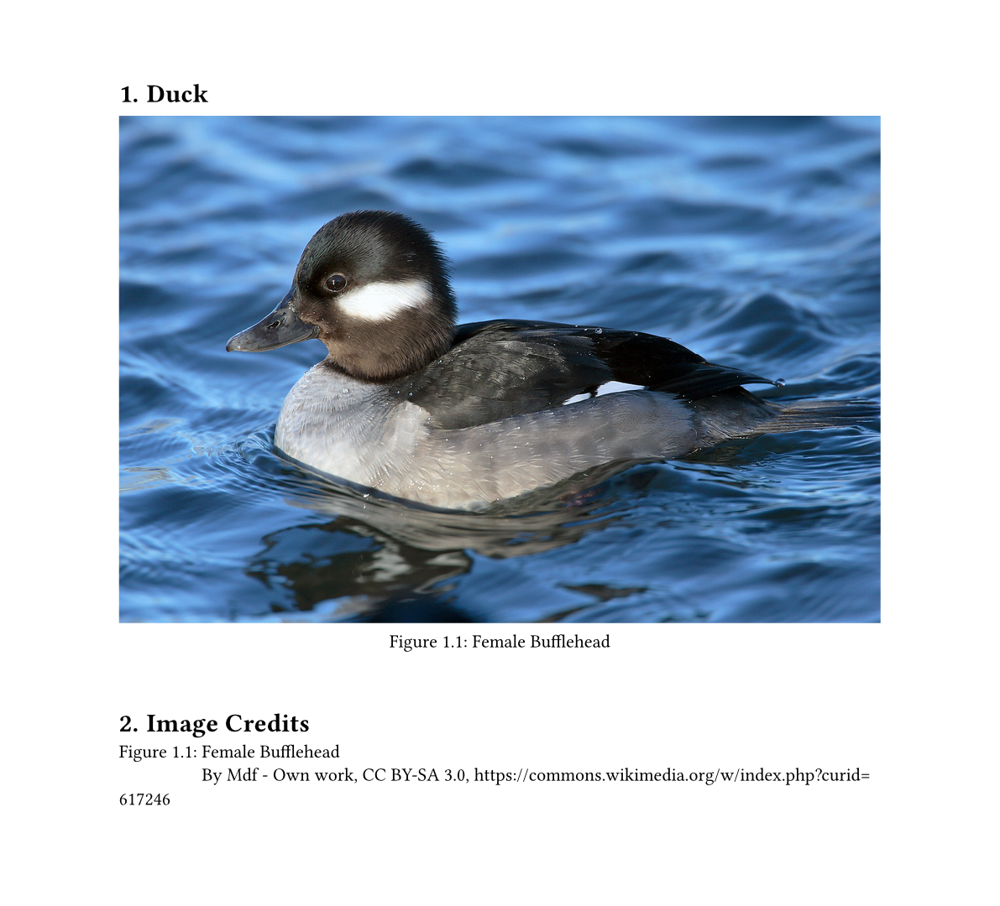

# Image Credits

Use `#afigure` to create a figure with attribution information, then display a
list of attributions with `#image-credits`

```typst
#import "@preview/image-credits:0.1.0": afigure, image-credits

#afigure(
    image("duck.jpg"),
    caption: [Female Bufflehead],
    attr: [By Mdf - Own work, CC BY-SA 3.0, https://commons.wikimedia.org/w/index.php?curid=617246]
)

= Image Credits

// Reduce the spacing between the caption and the attribution
#show figure.caption: set block(below: 0.6em)

#image-credits()
```



## i-figured

Use with the `i-figured` package is also possible by providing the
`kind: "i-figured-image"` argument

```typst
#image-credits(kind: "i-figured-image")
```

`image` can be replaced with any other figure kind, so this works with tables
too by providing `kind: "i-figured-table"`



## API

```typst
#let image-credits(
    kind: image,
    template: default-entry
) = { /* ... */ }
```

- **kind:** The kind of figure to search for, which is passed to `figure.where`
- **template:** A template function for each credit entry

```typst
#let default-entry(index, figure, attribution) = {
  block(breakable: false, {
    figure.caption
    h(measure(figure.caption).width - measure(figure.caption.body).width)
    attribution
  })
}
```

This is the default template function, and the parameters a template function
has. Feel free to copy and adapt this to fit your project.
